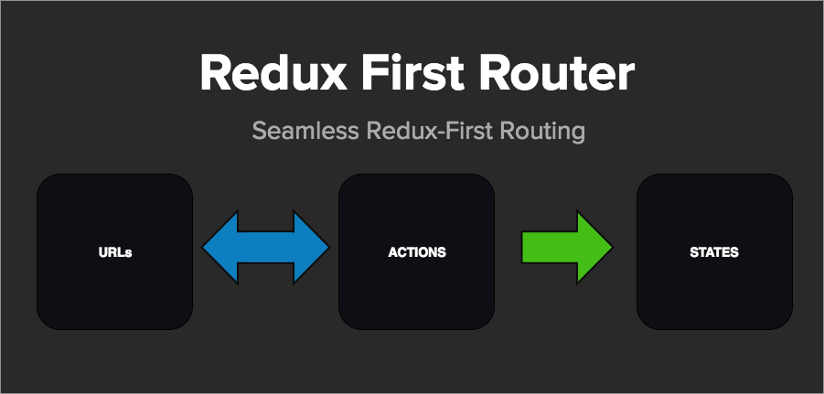
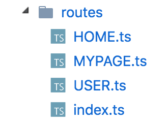

## ぼくのかんがえた

## さいきょうの React

---

## 自己紹介

### 光音 [@bboykoto](https://twitter.com/bboykoto)

* 某Ｙ社のフロントエンドエンジニア

* 業務で react を使っている

* 趣味では vue も使っている

* ブレイクダンサー（ダンサー仲間募集中）

---

## 今日話すこと

オススメのライブラリを淡々と話すだけ  
react 固有でないやつも紹介する

---

## 目次

* [prettier](https://prettier.io/)

* [normalizr](https://github.com/paularmstrong/normalizr)

* [reselect](https://github.com/reactjs/reselect)

* [recompose](https://github.com/acdlite/recompose)

* [redux-first-router](https://github.com/faceyspacey/redux-first-router)

* [immer](https://github.com/mweststrate/immer)

---

## prettier

+++

コードフォーマッター  
エディタ連携して保存時に発動させると最強

+++

問: eslint --fix でよくね？

答: prettier でしか整形できない項目もある

+++

例えば max-len  
eslint はアラートを出すだけ

```javascript
// prettier前
// prettier-ignore
foo(reallyLongArg(), omgSoManyParameters(), IShouldRefactorThis(), isThereSeriouslyAnotherOne());
```

```javascript
// prettier後
foo(
  reallyLongArg(),
  omgSoManyParameters(),
  IShouldRefactorThis(),
  isThereSeriouslyAnotherOne()
);
```

+++

max-len だけでなく色々設定できる  
詳しくは[公式ページ](https://prettier.io/docs/en/configuration.html) を参照

+++

eslint と設定が被るのでは？

（例）  
eslint は max-len:100  
prettier は max-len:80

+++

[prettier-eslint](https://github.com/prettier/prettier-eslint)  
prettier 後に eslint --fix を行う

[eslint-plugin-prettier](https://github.com/prettier/eslint-plugin-prettier)  
eslint のルールとして prettier の設定を書く

[eslint-config-prettier](https://github.com/prettier/eslint-config-prettier)  
eslint から prettier と被っている設定を無効化する

+++

**方法 1**  
prettier-eslint + eslint-config-prettier  
（私はこっち派）

**方法 2**  
eslint-plugin-prettier + eslint-config-prettier

+++

tslint もまったく同じことができる  
（ただし公式が出しているライブラリではない）

[prettier-tslint](https://github.com/azz/prettier-tslint)

[tslint-plugin-prettier](https://github.com/ikatyang/tslint-plugin-prettier)

[tslint-config-prettier](https://github.com/alexjoverm/tslint-config-prettier)

+++

ちなみに json や markdown も整形可

+++

最近 [ver1.0.0 がリリース](https://prettier.io/blog/2018/01/10/1.10.0.html#support-for-vue-single-file-components-3563-by-vjeux)され  
vue の単一ファイルにも対応した

+++

チーム開発時は precommit で発動させると Good  
コードレビューも本質的な部分に集中できる

「ここのインデントが･･･」とか言いたくない

---

## normalizr

+++

normalizr 公式訳

> 多くの API は深くネストされた JSON データを返す。このような構造は、JavaScript アプリケーション、特に Flux または Redux を使用するときによく問題となる。

+++

normalizr で JSON データを  
正規化することによって解決できる

+++

normalizr 前

```json
{
  "id": "123",
  "author": {
    "id": "1",
    "name": "Paul"
  },
  "title": "My awesome blog post",
  "comments": [
    {
      "id": "324",
      "commenter": {
        "id": "2",
        "name": "Nicole"
      }
    }
  ]
}
```

+++

normalizr 後

```javascript
{
  result: "123",
  entities: {
    "articles": {
      "123": {
        id: "123",
        author: "1",
        title: "My awesome blog post",
        comments: ["324"]
      }
    },
    "users": {
      "1": { "id": "1", "name": "Paul" },
      "2": { "id": "2", "name": "Nicole" }
    },
    "comments": {
      "324": { id: "324", "commenter": "2" }
    }
  }
}
```

@[2](result: 参照用 ID だけをもった配列)
@[3-19](entities: データを保持するオブジェクト)

+++

result と entities は分けて store に格納

+++

store も DB と同じように考えると楽  
author と commenter も同じ user のはず

+++

正規化すると

* 無駄なネストが少なくなる
* データに参照しやすくなる

+++

[Redux 公式](https://redux.js.org/docs/recipes/reducers/NormalizingStateShape.html)にも書いてある

> data needs to be transformed into a normalized shape before it can be included in the state tree. The Normalizr library is usually used for this task.

---

## reselect

+++

よくあるやつ

```javascript
const getVisibleTodos = (todos, filter) => {
  switch (filter) {
    case "SHOW_ALL":
      return todos;
    case "SHOW_COMPLETED":
      return todos.filter(t => t.completed);
    case "SHOW_ACTIVE":
      return todos.filter(t => !t.completed);
  }
};

const mapStateToProps = state => {
  return {
    todos: getVisibleTodos(state.todos, state.visibilityFilter)
  };
};
```

@[12-16](<getVisibleTodos()が何度も...>)
@[14](View が state を指定するのも...)
@[1-10](ロジックを View に持たせたくない)

+++

```javascript
import { createSelector } from "reselect";

export const getVisibleTodos = createSelector(
  [state => state.visibilityFilter, state => state.todos],
  (visibilityFilter, todos) => {
    switch (visibilityFilter) {
      case "SHOW_ALL":
        return todos;
      case "SHOW_COMPLETED":
        return todos.filter(t => t.completed);
      case "SHOW_ACTIVE":
        return todos.filter(t => !t.completed);
    }
  }
);

const mapStateToProps = state => {
  return {
    todos: getVisibleTodos(state)
  };
};
```

@[4](inputSelectors)
@[5-14](resultFunc)

+++

inputSelectors で  
指定した state の更新時以外は  
計算せずに前回の内容を返す  
(Memoized)

+++

normalizr との相性が抜群

+++

reselect も[redux 公式](https://redux.js.org/docs/recipes/ComputingDerivedData.html)に書いてある

> Reselect selectors can be used to efficiently compute derived data from the Redux store.

---

## recompose

+++

SFC や HOC が使いやすくなる

+++

recompose 公式訳

> React 版 lodash と考えて

+++

```javascript
const Enhance = compose(
  withState("counter", "updateCounter", 0),
  withHandlers({
    increment: ({ updateCounter }) => () => {
      updateCounter(counter => counter++);
    }
  })
);

const App = ({ counter, increment }) => {
  return (
    <div>
      <div>count: {counter}</div>
      <button onClick={increment}>+</button>
    </div>
  );
};

export default Enhance(App);
```

+++

カウンターが内部 state を持つことなく  
簡単に SFC で書くことができる

+++

* view からロジックが消えていく
* SFC が多くなるのでテストも容易に
* state に限らず lifecycle などもある

+++

HOC の可読性が上がる！  
便利な関数がたくさんある！

---

## redux-first-router

+++

ルーティングライブラリ  


+++

action と URL を紐付けて管理

```javascript
const routesMap = {
  HOME: "/home",
  USER: "/user/:id" // :id は動的
};
```

+++

ページ遷移する方法

```javascript
// Linkを使用
<Link to="/user/123">User 123</Link>
<Link to={{ type: 'USER', payload: { id: 456 } }}>User 456</Link>

// actionを発行
const mapDispatchToProps = (dispatch) => ({
  onClick: () => dispatch({ type: 'USER', payload: { id: 789 } })
})
<span onClick={onClick}>User 789</span>
```

+++

URL や action 発行で  
ルーティングを変更することが可能

+++

ページ遷移前後に処理が追加できる

```javascript
// configureStore.js
import { connectRoutes } from "redux-first-router";

const options = {
  onBeforeChange: (dispatch, getState, action) => {
    // 認証処理など
  }
};

connectRoutes(history, routesMap, options); // 第3引数に追加
```

+++

非同期処理を挟むことも可能

```javascript
// routeMap
export default {
  HOME: "/",
  USER: {
    path: "/user/:id",
    thunk: async (dispatch, getState) => {
      const { id } = getState().location.payload;
      const data = await fetch(`/api/user/${id}`);
      const user = await data.json();
      const action = { type: "USER_FOUND", payload: { user } };
      dispatch(action);
    }
  }
};
```

+++

DidMount での fetch が減る(SFC が増える)

+++

routeMap が肥大化しそうなので  
ディレクトリ構造はこんな感じにしている  


+++

最近使っていて今のところ困ることは無いが  
記事があまりにも少なすぎるので  
みなさん使って記事を書いてください  
m(\_\_)m

---

## immer

+++

普通の JS の取り回しで  
Immutable なオブジェクトを生成できるライブラリ  
（MobX 作者がつくっている）

+++

ImmutableJS みたいに  
独特の記法を覚えまくる必要はない

+++

```javascript
import produce from "immer";

const baseState = [
  {
    todo: "Learn typescript",
    done: true
  },
  {
    todo: "Try immer",
    done: false
  }
];

const nextState = produce(baseState, draftState => {
  draftState.push({ todo: "Tweet about it" });
  draftState[1].done = true;
});
```

+++

reducer をめっちゃ簡素にできる

+++

素 JS

```javascript
const byId = (state, action) => {
  switch (action.type) {
    case RECEIVE_PRODUCTS:
      return {
        ...state,
        ...action.products.reduce((obj, product) => {
          obj[product.id] = product;
          return obj;
        }, {})
      };
    default:
      return state;
  }
};
```

+++

immer

```javascript
import produce from "immer";

const byId = (state, action) =>
  produce(state, draft => {
    switch (action.type) {
      case RECEIVE_PRODUCTS:
        action.products.forEach(product => {
          draft[product.id] = product;
        });
    }
  });
```

+++

使おう

---

## おしまい
